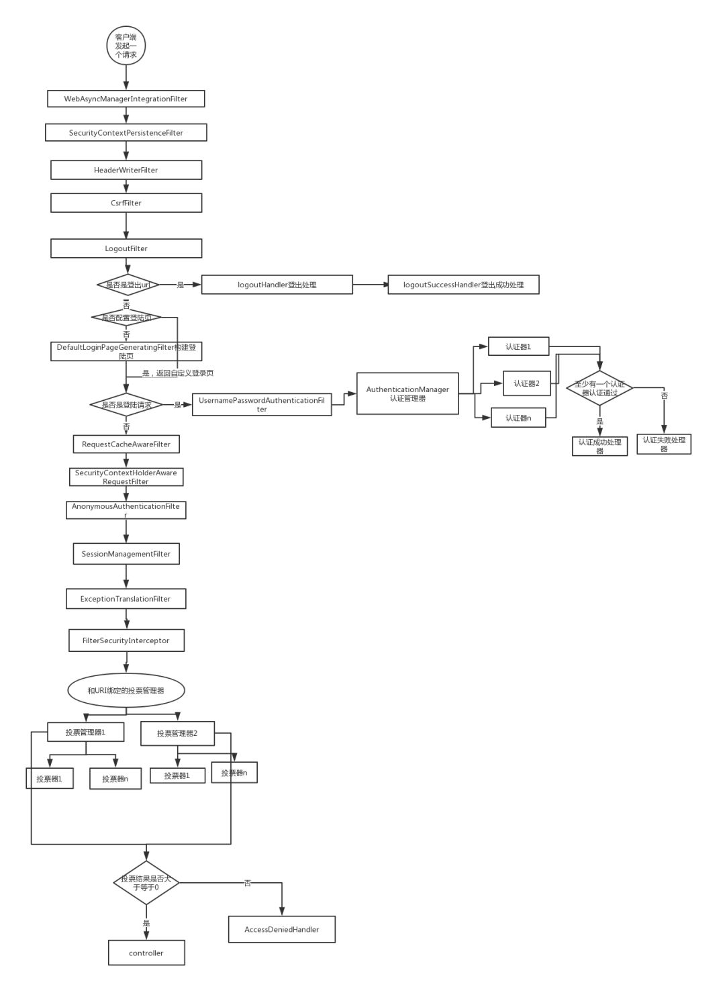

Spring Security 用户登录及 token 认证
===

### 项目运行
1. 启动项目, 默认端口 8080
2. 访问 localhost:8080/login 输入用户名和密码(配置在 WebSecurityConfiguration.configure(AuthenticationManagerBuilder auth) 中)
3. 登录成功返回用户登录成功的 token 

4. 用获取到的 token 访问服务器资源

### Spring Security 架构及原理
1. 架构

2. 认证流程
  - 认证流程逻辑
  
  - AuthenticationFilter 配置及工作流程
  
  - 认证流程组件关系
    
  
3. 组件说明
  - SecurityContext 安全认证上下文，用户通过Spring Security 的校验之后，验证信息存储在SecurityContext中
  - SecurityContextHolder 在 SecurityContextPersistenceFilter 生成 SecurityContext 并存储在 SecurityContextHolder 中。SecurityContextHolder 有三种SecurityContext的存储策略：
    - MODE_THREADLOCAL：SecurityContext 存储在线程中，为spring security 默认方式
    - MODE_INHERITABLETHREADLOCAL：SecurityContext 存储在线程中，但子线程可以获取到父线程中的 SecurityContext
    - MODE_GLOBAL：SecurityContext 在所有线程中都相同
  - AuthenticationFilter 安全认证过滤器
  - Authentication 用户安全认证信息
  - AuthenticationManager 权限校验管理器
  - AuthenticationProvider 权限校验对象
  - AccessDecisionManager 决策管理器
  - AccessDecisionVoter 用户权限决策对象
  - UserDetailsService 用户信息服务对象
  - UserDetails 用户信息

### 参考资料
1. [Spring Security 入门原理及实战](http://www.zijin.net/news/tech/1190163.html)
2. [Spring Security 工作原理概览](https://blog.csdn.net/u012702547/article/details/89629415)
3. [Spring Cloud OAuth2 扩展登陆方式](https://www.cnblogs.com/fp2952/p/9193959.html)
4. [spring-security 权限控制详解](https://www.cnblogs.com/fp2952/p/8933107.html)
5. [Spring Secutity 自定义权限配置](https://segmentfault.com/a/1190000010232638)
6. [Spring Security 之多AuthenticationProvider认证模式实现](https://blog.csdn.net/yaomingyang/article/details/98785488)
7. [spring security 核心 access-control](https://www.jianshu.com/p/2b6ebe9423f2)
